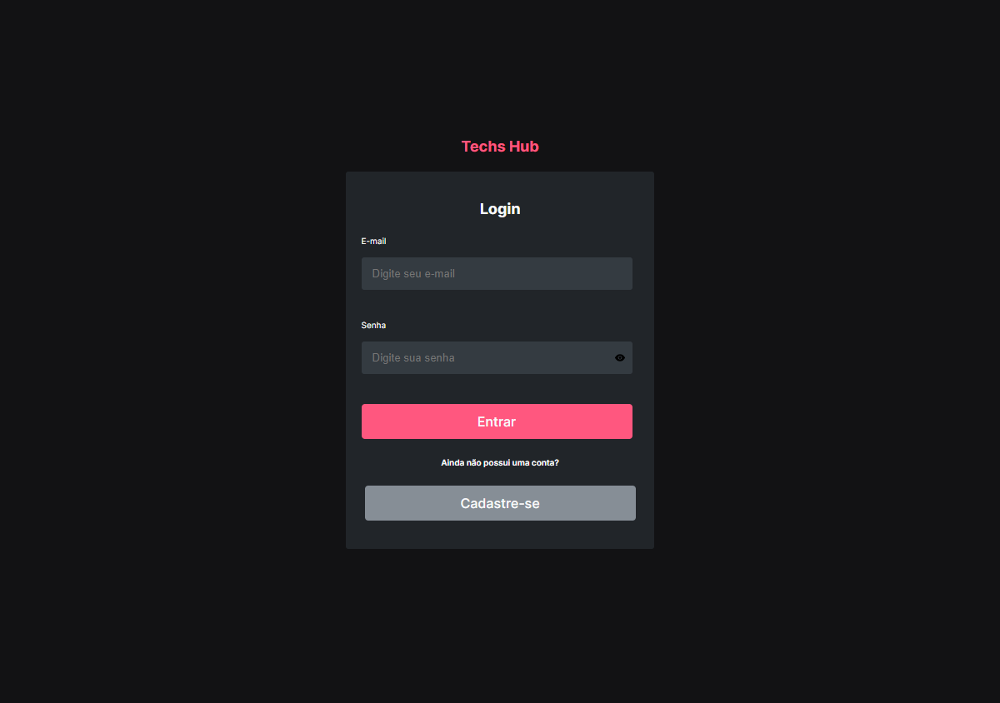
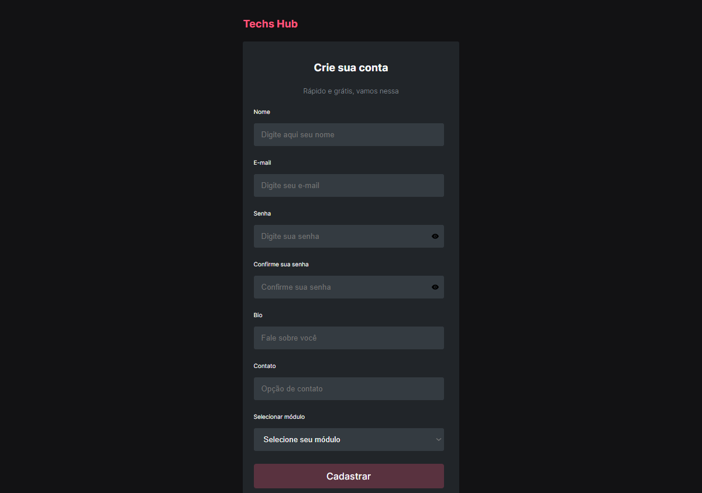
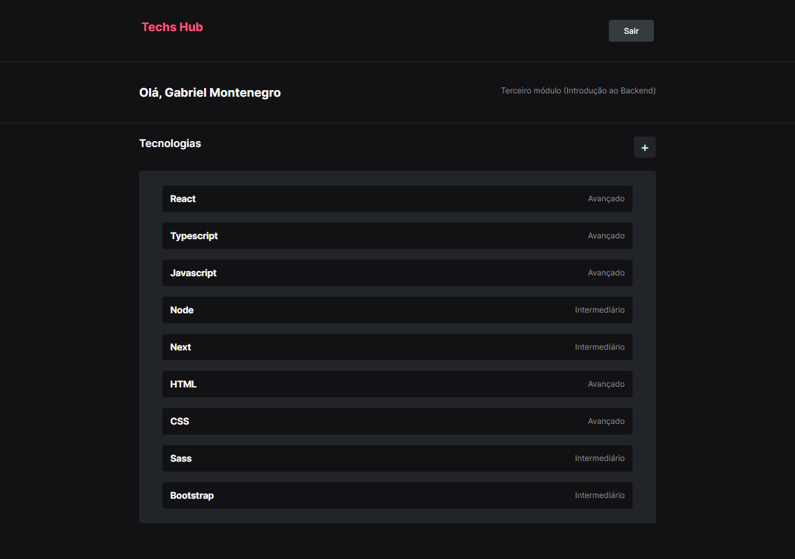
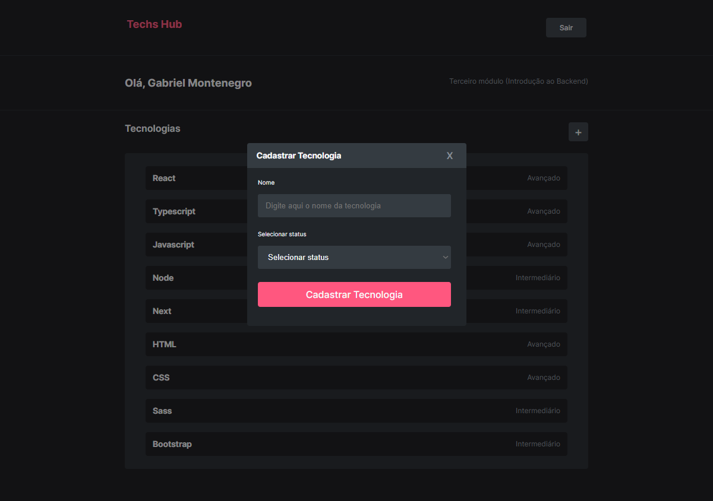
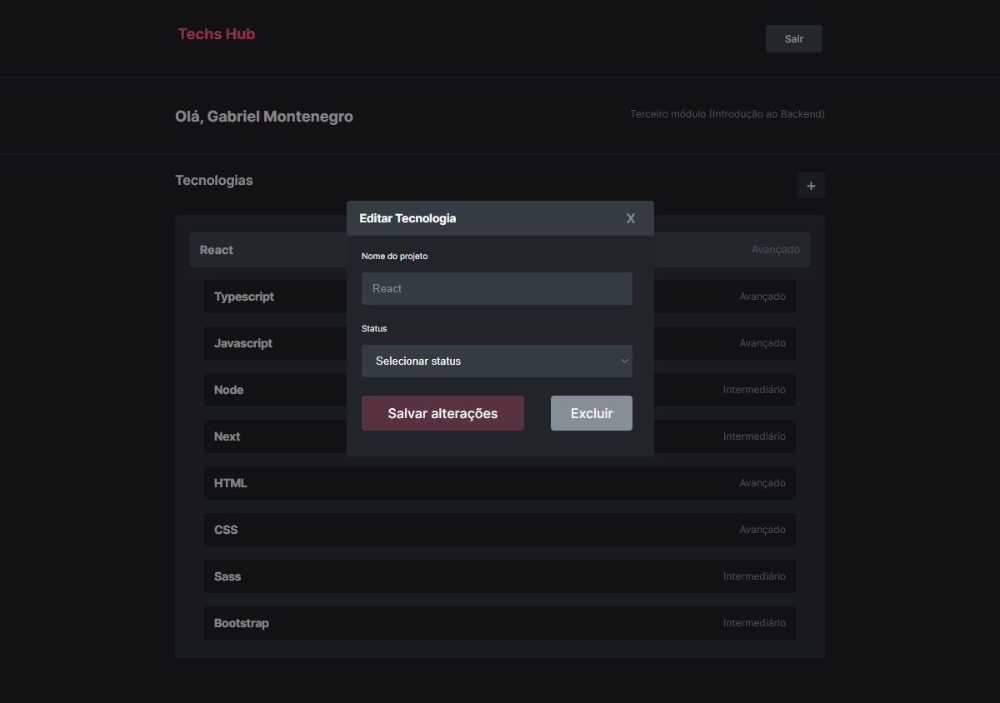

# Techs Hub

## Seções do projeto

-   [Descrição do Projeto](#descrição-do-projeto)
-   [Técnicas e Tecnologias utilizadas no Projeto](#🔨-técnicas-e-tecnologias-utilizadas-no-projeto)
-   [Ajustes e Melhorias](#🚀-ajustes-e-melhorias)
-   [Pré requisitos](#💻-pré-requisitos)
-   [Instalando o projeto](#🚀-instalando-projeto)
-   [Usando o projeto](#☕-usando-o-projeto)
-   [Colaboradores](#🤝-colaboradores)

## ✔️ Descrição do projeto

Aplicação para controle de aprendizado de tecnologias Web.

-   Login
    

-   Cadastro
    
    

-   Ao logar, você é redirecionado para a Dashboard
    

-   Modal para cadastro de nova tecnologia na sua Dashboard
    

-   Modal para atualização do status da tecnologia da sua Dashboard  
    

## 🔨 Técnicas e Tecnologias utilizadas no Projeto

-   `React`
-   `Figma`
-   `Github`
-   `Git`
-   `Vercel`

## 🤝 Colaboradores

<table>
  <tr>
    <td align="center">
      <a href="http://github.com/isgabriel">
         
        
          <b>Gabriel Montenegro</b>
        
      </a>
    </td>
  </tr>
</table>

[⬆ Voltar ao topo](#techs-hub) 
